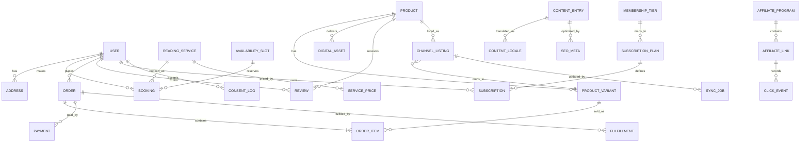
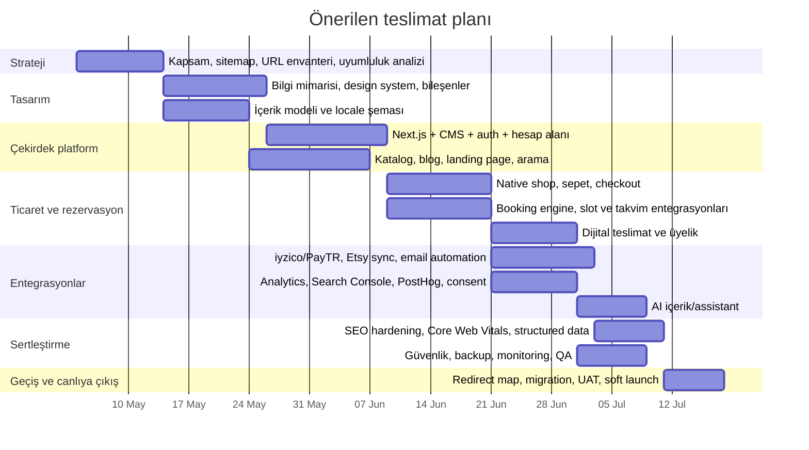

# Türkçe Astroloji ve Tarot E-Ticaret Platformu için Modern Full‑Stack Araştırma Raporu

## Yönetici özeti

Bu kapsam için en dengeli çözüm, **içerik ve SEO ağırlıklı modüler bir monolit** kurmaktır: **Next.js App Router + TypeScript + Payload CMS + PostgreSQL + Redis + Meilisearch + obje depolama + edge CDN/WAF + ayrı worker servisleri**. Bu yaklaşım; sunucu tarafı render, JSON‑LD, çok dilli yönlendirme, içerik yönetimi, üyelik, rezervasyon ve ödeme akışlarını aynı ürün kod tabanında toplarken; Etsy senkronizasyonu, e‑posta otomasyonları, AI batch işleri ve webhook tekrar denemelerini arka plan worker katmanına iterek operasyonel karmaşıklığı kontrol altında tutar. Payload çoklu locale desteği sunuyor; Next.js hem managed hem self‑host dağıtımı destekliyor; Meilisearch çok dilli indeksleme yapabiliyor; yönetilen PostgreSQL/Supabase katmanı ise auth, storage ve edge function tarafını hızlandırabiliyor. citeturn36search0turn29search0turn0search3turn18search15turn32search11turn32search1turn32search0

İş modeli içerik + hizmet + butik e‑ticaret + reklam + affiliate olduğu için platformun “dev mağaza” değil, **yüksek dönüşümlü içerik/rezervasyon makinesi** gibi tasarlanması daha doğru olur. Yani ana odak; hızlı landing page’ler, güven veren ödeme akışı, takvim/uygunluk, satın alma sonrası dijital teslimat, otomasyon, ilk parti veri toplama ve güçlü ölçümleme olmalıdır. Yerel ödeme kabulü için **entity["company","iyzico","turkiye payments"]** ve **entity["company","PayTR","turkiye payments"]** daha gerçekçi başlangıç seçenekleridir; **entity["company","Stripe","payments platform"]** ise resmî ülke desteği ve şirket yapılanması uygunsa küresel katman olarak düşünülmelidir. Etsy tarafında **entity["company","Etsy","online marketplace"]** Open API; OAuth, listing/inventory işlemleri ve webhook yapılarıyla senkronizasyona uygundur. citeturn3search1turn3search7turn22search2turn22search0turn4search8turn4search2turn0search9turn0search15

Rezervasyon tarafında kritik bulgu şudur: self‑hosted **Cal.diy** dokümantasyonu bunu topluluk sürümü ve kişisel/non‑production kullanım için öneriyor; bu nedenle üretimde ya **hosted entity["company","Cal.com","scheduling platform"]** ya da doğrudan sizin veri modelinizle çalışan **native booking engine** tercih edilmelidir. Bu projede native booking daha iyi eşleşir; çünkü tarot/astroloji seansı, slot, hazırlık süresi, ön anket, Zoom/Meet linki, dijital rapor teslimi ve tekrar rezervasyon mantığı klasik meeting araçlarından daha özeldir. citeturn20search0turn20search4turn20search14turn20search12

SEO tarafında başarı; SSR/SSG hibrit yapısı, doğru canonical/hreflang, ürün ve içerik şemaları, sitemaps, kontrollü JavaScript kullanımı ve Core Web Vitals disiplinine bağlıdır. Resmî eşikler hâlâ saha verisinin 75. persentilinde **LCP ≤ 2.5s**, **INP ≤ 200ms**, **CLS ≤ 0.1** olarak tanımlanıyor. Ayrıca Google, FAQ rich result görünürlüğünü artık büyük ölçüde devlet ve sağlık gibi otoriter sitelerle sınırlıyor; dolayısıyla FAQ JSON‑LD yine eklenmeli ama bunun SERP’te kart olarak çıkmasını ana beklenti yapmamak gerekir. citeturn9search0turn9search5turn26search0turn8search13turn28search0turn9search1

Uyumluluk tarafında Türkiye özelinde en önemli başlık; **KVKK çerez ve açık rıza kurgusunu** “genel gizlilik metni” ile karıştırmamaktır. KVKK’nın çerez rehberi; aydınlatmanın giriş aşamasında yapılmasını, çerez adı/amacı/süresi/birinci‑üçüncü taraf bilgilerinin açıklanmasını ve açık rıza ile aydınlatmanın ayrı yürütülmesini vurguluyor. 2026 tarihli ilke kararı duyurusu da aydınlatma metni ile açık rıza metninin ayrı düzenlenmesi gerektiğini tekrar netleştiriyor. Google reklam ürünleri için ise EEA/UK/İsviçre’ye kişiselleştirilmiş reklam gösteriliyorsa Google sertifikalı CMP gerekliliği devam ediyor. Türkiye’de e‑ticaret faaliyeti için ETBİS ve ilgili Ticaret Bakanlığı mevzuat başlıkları da ayrıca kontrol edilmelidir. citeturn11view0turn10search17turn10search3turn25search0turn25search1turn15search1turn15search11turn15search5

## Varsayımlar ve karar çerçevesi

Bu rapor aşağıdaki varsayımlar üzerine kuruludur. Belirsiz kalan her nokta mimariyi etkiler; ama aşağıdaki varsayımlarla öneri seti yüksek güven düzeyinde uygulanabilir durumdadır.

| Varsayım | Etkisi |
|---|---|
| Birincil dil **Türkçe**; ikincil diller henüz net değil. | i18n altyapısı zorunlu, fakat başlangıçta `tr` tek başına canlıya alınabilir. |
| Site sahibi **tek satıcı / tek işletme**; iki taraflı pazar yeri kurulmayacak. | Native shop basitleşir; Etsy ayrı “kanal” olarak modellenir. |
| Okumalar **eğlence / spiritüel danışmanlık** çerçevesinde sunulacak; tıbbi, hukuki, finansal vaatler verilmeyecek. | İçerik, structured data ve reklam politikası riski düşer. |
| Mevcut site ve URL envanteri bilinmiyor. | Taşıma stratejisi genel migration prensipleriyle verildi. |
| Şirket yapılanması ve ödeme lisansları belirtilmedi. | Türkiye için iyzico/PayTR önceliklendirildi; Stripe opsiyonel bırakıldı. |

Karar kriterlerini ağırlıklandırdığımda öncelik sırası şu şekildedir: **SEO ve içerik performansı**, **özel rezervasyon akışları**, **Türk ödeme ve uyumluluk gerçekleri**, **operasyonel sadelik**, **uzun vadeli esneklik**. Bu nedenle ilk tercih olarak ağır headless‑commerce yerine, içerik merkezli bir uygulama omurgası üzerinde ticaret/rezervasyon modülleri öneriyorum. Medusa benzeri ayrı commerce motoru ise katalog, varyant, kampanya ve entegrasyon yükü belirgin biçimde büyürse ikinci evrede ayrıştırılmalıdır. citeturn0search2turn0search4turn0search5turn36search0turn29search0

## Önerilen mimari ve teknoloji yığını

### Önerilen referans mimari

**Önerilen üretim mimarisi**

- Sunum katmanı: Next.js App Router, SSR/SSG/ISR hibriti
- İçerik yönetimi: Payload CMS
- İş uygulaması: aynı monorepoda modüler domain servisleri
- Veri: PostgreSQL
- Auth: Supabase Auth veya Auth.js tabanlı cookie session
- Arama: Meilisearch
- Kuyruk/cache: Redis + BullMQ benzeri iş kuyruğu
- Dosya depolama: S3 uyumlu storage
- Worker’lar: Etsy sync, e‑posta tetikleme, AI görevleri, search indexing
- Edge/CDN/WAF: Cloudflare
- Frontend deployment: Vercel veya self‑hosted Node + reverse proxy
- Ölçümleme: GA4 + Search Console + PostHog
- E‑posta/CRM: Brevo başlangıçta; gerekiyorsa HubSpot/Klaviyo katmanı
- AI: OpenAI veya Anthropic API + embedding/vectordb

Bu tasarımın en önemli gerekçesi, Next.js’in SEO ve performans için gerekli sunucu tarafı yapılarını; Payload’in içerik ve locale yönetimini; PostgreSQL’in sipariş/rezervasyon/üyelik gibi ilişkisel yükleri; Meilisearch’in site içi aramayı; ayrı worker katmanının ise webhook ve senkron işlerini temiz biçimde karşılamasıdır. Next.js self‑host senaryosunda reverse proxy ve çoklu instance cache koordinasyonu öneriyor; bu da hibrit “frontend edge + arka planda container worker” modelini mantıklı kılıyor. citeturn29search0turn36search0turn0search3turn18search15turn32search11turn21search0

### Stack seçenekleri karşılaştırması

| Seçenek | Güçlü yanlar | Zayıf yanlar | Ne zaman seçilir | Kaynak |
|---|---|---|---|---|
| **Önerilen:** Next.js + Payload + PostgreSQL + Redis + custom commerce/booking | SEO için SSR/JSON‑LD güçlü; CMS ve uygulama aynı TypeScript ekosisteminde; booking, membership, affiliate, AdSense ve özgün funnel’lar için esnek | Commerce kabiliyetleri size özel geliştirileceği için ilk faz geliştirme disiplini ister | İçerik + rezervasyon + butik shop + üyelik odaklı projelerde | citeturn36search0turn29search0turn0search3 |
| Next.js + Medusa + ayrı CMS | Medusa dijital ürünler, subscription purchases ve starter marketplace yetenekleriyle commerce yükünü azaltır | Ayrı commerce servisinin DevOps karmaşıklığı artar; booking yine özel iş kalır | SKU, varyant ve promosyon kuralları hızla büyürse | citeturn0search2turn0search4turn0search5 |
| WordPress + WooCommerce | Hızlı lansman, geniş eklenti ekosistemi, açık kaynak; downloadable product senaryoları hazır | Custom SEO/AI/booking/çoklu entegrasyonlarda teknik borç hızlı büyür | Düşük bütçeli MVP ve editör odaklı ekiplerde | citeturn33search4turn33search10turn33search1 |
| Next.js + Strapi | i18n, REST ve GraphQL locale desteği nettir; headless CMS ekipleri için tanıdık | Payload’a göre tek repo hissi daha zayıf; editör ve deployment ayrımı daha sert | Ayrı API/CMS sınırları isteniyorsa | citeturn19search0turn19search3turn19search12 |

### CMS seçenekleri karşılaştırması

| CMS | Artı | Eksi | Bu proje için not | Kaynak |
|---|---|---|---|---|
| **Payload** | Locale desteği, Next ekosistemine yakınlık, uygulama + CMS birlikteliği | Geliştirici ağı Wordpress kadar geniş değil | En iyi denge | citeturn0search3 |
| Sanity | Güçlü editör deneyimi, esnek içerik modeli, lokalizasyon ve AI Assist | SaaS bağımlılığı ve fiyatlandırma büyümede etkili olabilir | Editör ekip güçlü ise iyi seçenek | citeturn19search1turn19search16 |
| Strapi | Açık kaynak, i18n ve locale API desteği | Ayrı yönetim yüzü + ayrı uygulama operasyonu | Geliştirici ekip API‑first ise mantıklı | citeturn19search0turn19search3turn19search12 |
| WordPress | Editör tarafı çok tanıdık, plugin ekosistemi çok büyük | Plugin bağımlılığı ve performans borcu riski | SEO içerik tarafı kolay; özel iş akışlarında zorlaşır | citeturn33search4turn33search10 |

### Ödeme, rezervasyon ve kanal entegrasyonları

| Alan | Öneri | Neden | Dikkat edilmesi gereken | Kaynak |
|---|---|---|---|---|
| Türkiye ödemeleri | iyzico | Hosted checkout, API, subscription ve marketplace bileşenleri var | Komisyon ve operasyonel sözleşme ayrıca değerlendirilir | citeturn3search1turn3search0turn3search2turn3search7 |
| Türkiye ödemeleri | PayTR | Direct/iFrame API, kayıtlı kart ve tekrar eden ödeme akışları mevcut | Callback’te doğru “OK” yanıtı kritik; yoksa ödeme tamamlanmış sayılmaz | citeturn22search2turn22search0turn22search9turn22search21 |
| Küresel ödemeler | Stripe | Checkout, subscriptions ve çok sayıda local payment method desteği | Ülke desteği şirket yapınıza bağlı | citeturn4search3turn4search2turn4search6turn4search8 |
| Rezervasyon | Hosted Cal.com veya native booking | Routing, recurring events ve API var | Cal.diy self‑host üretim için önerilmiyor | citeturn20search0turn2search3turn2search5turn20search4turn20search14 |
| Etsy kanal entegrasyonu | Etsy Open API + webhook + reconciliation worker | OAuth, listing/inventory/order senkronu ve webhook altyapısı var | Etsy checkout ve native checkout için “source of truth” kuralı net olmalı | citeturn0search9turn0search15 |

### E‑posta, CRM, analytics, AI ve hosting karşılaştırmaları

#### E‑posta ve CRM

| Araç | En uygun kullanım | Güçlü yanlar | Dikkat | Kaynak |
|---|---|---|---|---|
| **entity["company","Brevo","email platform"]** | En dengeli başlangıç | Marketing + transactional + form + automation + CRM benzeri yapı tek yerde; düşük giriş fiyatı | Gelişmiş ecommerce derinliği Klaviyo kadar güçlü olmayabilir | citeturn30search1turn5search0 |
| **entity["company","Klaviyo","ecommerce marketing"]** | E‑commerce ağırlıklı büyüme | Segmentasyon, attribution ve mağaza tetiklemeleri güçlü | Liste büyüdükçe maliyet artabilir | citeturn30search2turn5search2 |
| **entity["company","Mailchimp","email marketing"]** | Genel SMB pazarlama | Düşük bariyer, yaygın kullanım | Ecommerce automations/CRM derinliği sınırlı kalabilir | citeturn30search4turn5search1turn5search12 |
| **entity["company","HubSpot","crm software"]** | CRM‑first ekipler | Ücretsiz CRM’den başlayıp marketing/sales/service’e büyütme | Tüm paketleri açıldığında maliyet hızla artabilir | citeturn31search8turn31search2turn20search2 |

#### Analytics ve A/B testing

| Araç | Rol | Güçlü yanlar | Not | Kaynak |
|---|---|---|---|---|
| **entity["company","Google","search and ads company"]** Analytics 4 + Search Console | Trafik, e‑commerce, organik performans | Resmî recommended ecommerce events ve Search performans raporları | Kurulum consent ve event hijyeni ister | citeturn8search2turn8search6turn8search12turn35search2 |
| **entity["company","PostHog","product analytics"]** | Ürün analitiği + feature flags + experiments | Experiment/feature flag bağları güçlü | GA4’ün yerini değil, ürün analitiği boşluğunu doldurur | citeturn6search0turn6search4turn6search13 |
| **entity["company","Plausible","web analytics"]** | Gizlilik dostu basit analitik | Hafif script, EU odaklı, çerezsiz yaklaşım | Derin ürün analitiği için tek başına yeterli olmayabilir | citeturn6search1turn6search16 |
| **entity["company","Matomo","analytics platform"]** | KVKK/GDPR odaklı self‑host analitik | On‑premise ve privacy dökümantasyonu güçlü | Operasyon yükü vardır | citeturn6search2turn6search6turn6search9turn6search12 |

#### AI servisleri

| Servis | En iyi kullanım | Not | Kaynak |
|---|---|---|---|
| **entity["organization","OpenAI","ai research org"]** API | Türkçe içerik taslakları, ürün açıklamaları, chat assistant, RAG, web‑grounded research akışları | Fiyatlar token ve araç kullanımına göre değişir | citeturn17search1turn17search0 |
| **entity["company","Anthropic","ai company"]** Claude API | Uzun bağlam, editoryal kalite kontrolü, tool use ile agentic iş akışları | Fiyatlar model bazında USD | citeturn17search2turn17search8turn17search12 |
| Sanity AI Assist | Editör içi çeviri ve içerik yardımı | Sanity seçilirse anlamlı | citeturn19search16 |

#### Hosting ve altyapı

| Seçenek | Güçlü yanlar | Zayıf yanlar | Bu proje için rol | Kaynak |
|---|---|---|---|---|
| **entity["company","Vercel","deployment platform"]** | Next.js için en pürüzsüz managed deneyim, preview akışları | Worker/uzun iş yüklerinde tek başına yeterli değil | Frontend ve preview ortamları | citeturn6search3turn21search3 |
| **entity["company","Cloudflare","cdn and security"]** | CDN, DNS, WAF, DDoS, developer platform | Karmaşık stateful iş yüklerinde ek servis gerekebilir | CDN/WAF/edge katmanı | citeturn7search5turn7search0 |
| Render | Container, background worker, managed Postgres, PITR | Maliyet, managed kolaylığa karşı artar | Worker + API + DB için güçlü orta yol | citeturn34search1 |
| Railway / Fly.io | Hızlı container dağıtımı | Kurumsal governance/DB özellikleri farklılaşır | Worker veya küçük API servisleri | citeturn34search2turn34search0 |
| **entity["company","Amazon Web Services","cloud platform"]** Lightsail / RDS | Tahmin edilebilir VM ve kurumsal backup/PITR | Operasyon yükü daha yüksek | Daha kontrollü self‑host isteyen ekipler | citeturn34search3turn21search6turn21search20 |

### Önerilen açık kaynak kütüphaneler

Aşağıdaki kütüphaneler bu mimariye iyi oturur:

| Alan | Kütüphane |
|---|---|
| UI | `tailwindcss`, `shadcn/ui`, `lucide-react` |
| Form/doğrulama | `react-hook-form`, `zod` |
| Veri erişimi | `prisma` veya `drizzle-orm`, `@tanstack/react-query` |
| Uluslararasılaştırma | `next-intl` |
| Kuyruk | `bullmq`, `ioredis` |
| E‑ticaret yardımcıları | `money.js` benzeri para utils’leri, vergi/indirim domain servisleri |
| SEO | `next-sitemap`, `schema-dts`, `web-vitals` |
| İzleme | `@sentry/nextjs` |
| Arama | `meilisearch` JS client |

## Veri modeli ve API tasarımı

### ER diyagramı



Bu veri modeli üç ayrı satış/gelir kanalını aynı çekirdekte toplar: **native ürün satışı**, **okuma/rezervasyon satışı**, **affiliate/reklam gelir modeli**. Ayrıca `CHANNEL_LISTING` katmanı ile Etsy SKU’su ile native ürün varyantı arasında birebir ya da çok‑bire eşleme yapılabilir. `CONTENT_ENTRY`/`CONTENT_LOCALE` ayrımı; blog, kategori, hizmet ve landing page’ler için locale‑bazlı URL üretimi ve SEO alanlarını temiz tutar. Bu yapı, native shop büyürse Medusa benzeri ayrı commerce servisine kademeli ayrıştırmayı da kolaylaştırır. citeturn0search15turn0search9turn32search11

### API tasarım ilkeleri

- **Public read API** ile **authenticated customer API** ayrılmalı.
- Webhook girişleri **idempotent** olmalı.
- Rezervasyon, ödeme ve sipariş gibi kritik domain’lerde **event log/outbox** tutulmalı.
- Locale bilgi modeli URL’den gelmeli; header tabanlı gizli locale switch SEO tarafında kullanılmamalı.
- `POST` mutasyonlarında `Idempotency-Key` desteklenmeli.
- Etsy, ödeme ağ geçitleri, e‑posta ve analytics entegrasyonları ayrı integration namespace’lerinde tutulmalı.

### Önerilen endpoint yüzeyi

| Domain | Endpoint örnekleri | Açıklama |
|---|---|---|
| Katalog | `GET /api/v1/products`, `GET /api/v1/products/:slug`, `GET /api/v1/categories/:slug` | SEO sayfaları ve uygulama içi katalog |
| Arama | `GET /api/v1/search?q=` | Meilisearch/Typesense katmanı |
| Okumalar | `GET /api/v1/readings/services`, `GET /api/v1/readings/:slug/availability`, `POST /api/v1/bookings` | Hizmet, slot ve rezervasyon |
| Checkout | `POST /api/v1/cart`, `POST /api/v1/checkout/session`, `POST /api/v1/payments/confirm` | Shop + booking ortak checkout |
| Siparişler | `GET /api/v1/orders/:id`, `POST /api/v1/orders/:id/cancel` | Müşteri hesap alanı |
| Üyelik | `GET /api/v1/memberships/plans`, `POST /api/v1/subscriptions` | Membership / recurring access |
| Dijital teslimat | `GET /api/v1/downloads/:token` | Kısa ömürlü signed URL |
| Yorumlar | `POST /api/v1/reviews`, `GET /api/v1/reviews?productId=` | Moderasyonlu review sistemi |
| Auth | `POST /api/v1/auth/sign-in`, `POST /api/v1/auth/magic-link`, `POST /api/v1/auth/oauth/:provider` | Yerleşik auth akışları |
| Hesap | `GET /api/v1/me`, `PATCH /api/v1/me`, `GET /api/v1/me/bookings` | Profil ve geçmiş |
| İçerik/CMS | `GET /api/v1/content/:type/:slug`, `POST /api/v1/cms/revalidate` | Preview ve yayın sonrası invalidation |
| Entegrasyonlar | `POST /api/v1/webhooks/iyzico`, `POST /api/v1/webhooks/paytr`, `POST /api/v1/webhooks/etsy`, `POST /api/v1/integrations/etsy/sync` | Dış sistemler |
| Consent/uyumluluk | `POST /api/v1/consents`, `GET /api/v1/privacy/export`, `DELETE /api/v1/privacy/delete-request` | KVKK/GDPR süreçleri |
| Affiliate | `POST /api/v1/affiliate/click`, `GET /go/:slug` | Tıklama ölçümü ve redirect |

### Örnek webhook işleme kalıbı

```ts
// app/api/v1/webhooks/paytr/route.ts
import { NextRequest, NextResponse } from "next/server";
import { db } from "@/lib/db";

export async function POST(req: NextRequest) {
  const body = await req.formData();
  const merchantOid = String(body.get("merchant_oid") ?? "");
  const status = String(body.get("status") ?? "");
  const hash = String(body.get("hash") ?? "");

  // 1) İmza/hash doğrulaması
  // 2) Idempotency kontrolü
  const alreadyProcessed = await db.webhookEvent.findUnique({
    where: { provider_event_key: `paytr:${merchantOid}:${status}` },
  });

  if (alreadyProcessed) {
    return new NextResponse("OK"); // PayTR callback sözleşmesi için önemli
  }

  await db.$transaction(async (tx) => {
    await tx.webhookEvent.create({
      data: { provider: "paytr", provider_event_key: `paytr:${merchantOid}:${status}` },
    });

    if (status === "success") {
      await tx.order.update({
        where: { externalRef: merchantOid },
        data: { paymentStatus: "paid" },
      });
    }
  });

  return new NextResponse("OK");
}
```

PayTR dokümantasyonu callback çağrısına doğru yanıt verilmediğinde ödemenin tamamlanmış sayılmayacağını açıkça belirtiyor; bu yüzden callback handler’ı minimal, idempotent ve kuyruk dostu tasarlanmalıdır. citeturn22search9turn22search21

## SEO, içerik ve büyüme sistemi

### Teknik SEO mimarisi

Bu sitenin SEO başarısı için ana ilke, **önemli içeriğin ilk HTML içinde görünür olmasıdır**. Google JavaScript’i işler; ancak yine de crawling → rendering → indexing akışında kritik içerik, linkler, canonical, structured data ve robots sinyallerinin istemci tarafına gereksiz yere bırakılmaması gerekir. Bu nedenle ürün, hizmet, kategori, yazı ve yazar sayfaları SSR/SSG ağırlıklı; yalnızca dashboard, hesap, checkout sonrası alanlar tam dinamik olmalıdır. citeturn26search0turn36search0turn29search0

Ölçülmesi gereken minimum saha hedefleri şunlardır: **LCP ≤ 2.5 saniye**, **INP ≤ 200 ms**, **CLS ≤ 0.1**, ve bunlar saha verisinde 75. persentilde sağlanmalıdır. Bunun pratik sonucu; ağır hero görsellerinin kontrollü kullanılması, üçüncü taraf script bütçesi, kritik CSS/Font optimizasyonu, rezervasyon widget’larının lazy/hydrate tasarımı ve reklam script’lerinin sadece uygun yerleşimlerde tetiklenmesidir. citeturn9search0turn9search5turn9search10turn9search7turn9search9

### URL, canonical, hreflang ve sitemap deseni

| Konu | Öneri | Kaynak |
|---|---|---|
| Locale URL yapısı | `/tr/...`, `/en/...`, `/de/...`; locale’yi query param ile değil path ile taşıyın | citeturn28search0 |
| Canonical | Her sayfa kendi locale URL’sine self‑canonical vermeli | citeturn8search13turn27search0 |
| Hreflang | Tüm alternatifler karşılıklı birbirini göstermeli; `x-default` ana giriş/selector sayfasında kullanılmalı | citeturn28search0 |
| Sitemap | Ayrı sitemap index + içerik türü bazlı sitemap’ler + alternate locale girdileri | citeturn8search7turn8search16turn28search0 |
| Robots/noindex | Arama sonuçları, filtre kombinasyonları, hesap/checkout ve kopya varyasyonlar noindex olmalı | citeturn25search2 |
| Existing site migration | 301/308 kalıcı redirect, redirect chain’den kaçınma, en az 1 yıl redirect tutma, yeni sitemap ve Search Console güncellemesi | citeturn27search0turn9search2 |

**Önerilen URL örnekleri**

- `/tr`
- `/tr/astroloji/dogum-haritasi-yorumu`
- `/tr/tarot/ask-acilimi`
- `/tr/urun/kisiye-ozel-yildiz-haritasi-pdf`
- `/tr/magaza/duvar-posteri-gunes-burcu`
- `/tr/uyelik/kozmos-kulubu`
- `/tr/blog/2026-yay-burcu-mayis-yorumu`
- `/tr/sss`
- `/tr/gizlilik`
- `/tr/mesafeli-satis`
- `/go/amazon-astroloji-defteri`  ← affiliate redirect

### Yapılandırılmış veri stratejisi

Google ürün sayfalarında `Product` işaretlemeyi destekliyor ve mümkünse Merchant Center feed ile birlikte kullanmanın uygunluk alanını artırdığını söylüyor. Schema.org tarafında da `Product`; fiziksel ürün kadar hizmet sunumlarını da kapsayabilecek biçimde tanımlanıyor. Bu nedenle bu projede iki katman öneririm:  
**native shop ürünleri** için `Product`,  
**rezervasyon/hizmet landing page’leri** için durumuna göre `Product` veya `Service` eşlemesi. Kullanıcı talebiniz doğrultusunda aşağıda “reading product” için `Product` örneği veriyorum; ancak semantik olarak bookable hizmetlerde `Service` de gayet temiz bir tercihtir. citeturn8search4turn26search1turn8search10

Ayrıca önemli bir nüans var: `FAQPage` işaretlemesini kullanabilirsiniz; ancak Google’ın FAQ rich results görünürlüğü artık geniş çapta açık değil ve temel olarak hükümet/sağlık gibi otoriter sitelerde gösteriliyor. Yani markup’ı yine ekleyin, fakat bunu SERP CTR büyüsü gibi konumlandırmayın. citeturn8search0turn9search1

### Reading product için örnek JSON‑LD

```html
<script type="application/ld+json">
{
  "@context": "https://schema.org",
  "@type": "Product",
  "@id": "https://ornekalanadi.com/tr/tarot/ask-acilimi#product",
  "name": "Aşk Açılımı Tarot Okuması",
  "description": "30 dakikalık çevrim içi tarot okuması. İlişki dinamikleri, yakın dönem enerjileri ve kişiye özel notlar içerir.",
  "brand": {
    "@type": "Brand",
    "name": "Ornek Kozmik Atolye"
  },
  "category": "Tarot Reading",
  "image": [
    "https://ornekalanadi.com/images/tarot-ask-acilimi-cover.jpg"
  ],
  "sku": "TR-READING-LOVE-30",
  "audience": {
    "@type": "Audience",
    "audienceType": "Yetişkin"
  },
  "offers": {
    "@type": "Offer",
    "url": "https://ornekalanadi.com/tr/tarot/ask-acilimi",
    "priceCurrency": "TRY",
    "price": "1490.00",
    "availability": "https://schema.org/InStock",
    "itemCondition": "https://schema.org/NewCondition"
  },
  "aggregateRating": {
    "@type": "AggregateRating",
    "ratingValue": "4.9",
    "reviewCount": "128"
  }
}
</script>
```

### FAQ için örnek JSON‑LD

```html
<script type="application/ld+json">
{
  "@context": "https://schema.org",
  "@type": "FAQPage",
  "@id": "https://ornekalanadi.com/tr/sss#faq",
  "mainEntity": [
    {
      "@type": "Question",
      "name": "Tarot okuması ne kadar sürer?",
      "acceptedAnswer": {
        "@type": "Answer",
        "text": "Seçtiğiniz pakete göre 20 ile 45 dakika arasında sürer. Satın alma sonrası uygun zaman aralığı seçilir."
      }
    },
    {
      "@type": "Question",
      "name": "Dijital rapor ne zaman teslim edilir?",
      "acceptedAnswer": {
        "@type": "Answer",
        "text": "PDF raporlar çoğu pakette ödeme onayı sonrası otomatik, kişiselleştirilmiş paketlerde ise genellikle 24 saat içinde teslim edilir."
      }
    },
    {
      "@type": "Question",
      "name": "Seans sonrası tekrar rezervasyon yapabilir miyim?",
      "acceptedAnswer": {
        "@type": "Answer",
        "text": "Evet. Hesabım alanından geçmiş seanslarınızı görebilir ve uygunluk takviminden yeni rezervasyon oluşturabilirsiniz."
      }
    }
  ]
}
</script>
```

### Next.js içinde güvenli JSON‑LD render örneği

```tsx
export function JsonLd({ data }: { data: unknown }) {
  return (
    <script
      type="application/ld+json"
      dangerouslySetInnerHTML={{
        __html: JSON.stringify(data).replace(/</g, "\\u003c"),
      }}
    />
  );
}
```

Next.js, JSON‑LD için sayfa veya layout bileşenlerinde `<script type="application/ld+json">` yaklaşımını öneriyor. citeturn36search0

### İçerik stratejisi

Bu nişte organik görünürlük için en verimli yapı, **ticari niyet** ile **editoryal niyet**i ayrı kümelerde işletmektir.

**Ticari kümeler**
- doğum haritası yorumu
- tarot aşk açılımı
- ilişki uyum analizi
- transit / solar return danışmanlığı
- PDF astroloji raporları
- üyelik / premium içerik

**Editoryal kümeler**
- burç dönemsel yorumları
- retro / dolunay / yeniay içerikleri
- tarot açılım rehberleri
- astroloji sözlüğü
- “nasıl hazırlanılır” ve “ilk seans” içerikleri
- Etsy ürünlerine bağlanan dekor/hediye/ritüel içerikleri

En iyi model, Türkçe ana hub’lar altında **evergreen içerik + dönemsel içerik + dönüşüm landing page** üçgenidir. AI burada taslak, outline, meta önerisi, FAQ çıkarımı ve çok dilli ilk çeviri için kullanılmalı; ancak nihai yayın her zaman insan editör denetiminden geçmelidir. KVKK’nın üretken yapay zekâ rehberi, bu tür sistemlerin kişisel veriler açısından yaşam döngüsü boyunca dikkatle ele alınması gerektiğini vurgular; dolayısıyla chat log, kullanıcı notu veya okuma geçmişi AI kişiselleştirmede kullanılacaksa veri minimizasyonu ve açık rıza akışı ayrıca tasarlanmalıdır. citeturn37view0turn17search1turn17search2

### AdSense ve affiliate içerik stratejisi

AdSense için site, benzersiz ve kullanıcıya değer sunan içerik üretmeli; Google yeni eklenen bir site için site sahibi doğrulaması ve politika uygunluğu denetimi yaptığını, bunun birkaç gün ila 2‑4 hafta sürebileceğini belirtiyor. Bu nedenle reklam yerleşimini ilk günden agresif yapmak yerine, önce içerik kümelerini ve dönüşüm sayfalarını oturtmak daha doğrudur. Affiliate katmanında ise uzun kuyruklu “en iyi astroloji kitabı”, “tarot destesi seçimi”, “ritüel defteri”, “burç temalı hediye” gibi editoryal rehberler daha sürdürülebilir gelir üretir. citeturn8search14turn8search5turn8search20

Affiliate ağları için başlangıç önerim; ürün çeşitliliği için **entity["company","Awin","affiliate network"]**, çok kanallı ortaklık/creator/referral yapıları için **entity["company","impact.com","partnership platform"]**, geleneksel performans ortaklığı için **entity["company","CJ","affiliate network"]**, Türkiye’de son kullanıcı ürün çeşitliliği için **entity["company","Amazon","retail and cloud"]** Türkiye gelir ortaklığıdır. Awin ve CJ tarafı daha çok ağ yapısı; impact.com ise affiliate + creator + referral’ı aynı ortaklık platformunda topluyor. citeturn23search6turn23search9turn24search15turn24search0turn24search7turn24search3turn24search12

## DevOps, güvenlik ve uyumluluk

### Dağıtım ve CI/CD

Üretim kurulumu için en temiz model:

- `main` → production
- `develop` → staging
- Her PR için preview deployment
- Otomatik testler: lint, typecheck, unit, integration, SEO smoke tests
- Deployment onayı: environment protection rules
- Secret yönetimi: hosting platform secret store + ayrı rotasyon planı

**entity["organization","GitHub","code hosting"]** Actions; build/test/deploy otomasyonunu, environment secret ve protection kurallarıyla destekliyor. Next.js self‑host modelinde reverse proxy önerildiği için, Vercel dışına çıkarsanız Nginx/Traefik ön katmanı koymanız gerekir. citeturn21search0turn21search8turn21search12turn29search0

### Ölçeklenme ve yedekleme

Ölçekleme stratejisi “sayfa trafiği” ve “arka plan işi”ni ayırmalıdır. Marketing trafiği CDN ve SSR cache ile yatay ölçeklenirken; Etsy sync, AI üretimi, e‑posta akışı ve ödeme webhook’ları worker sayısı ile ölçeklenmelidir. Çok instance çalışan Next.js kurulumu için cache’lerin tek pod içinde kalmaması gerekir; Next.js özel cache handler ile Redis/S3 türü taşıyıcılara yönlendirilebilir. citeturn29search0

Veritabanında günlük otomatik backup, point‑in‑time restore ve tercihen cross‑region kopya önerilir. AWS RDS bunu yerleşik olarak destekliyor; Render da yönetilen Postgres katmanında PITR ve yedekleme özellikleri sunuyor. Bu proje için “sipariş + rezervasyon + ödeme” birleşimi nedeniyle PITR lüks değil, zorunluluktur. citeturn21search6turn21search2turn21search20turn34search1

### Uygulama güvenliği

Bu dikeyde minimum güvenlik tabanı şunlar olmalı:

- WAF/DDoS koruması
- rate limiting
- bot koruma
- CSRF/origin kontrolü
- webhook imza doğrulama
- admin rol ayrımı
- MFA
- audit log
- dependency scanning
- güvenli dosya teslimi için signed URL
- hassas alanlarda field‑level encryption veya en azından ayrı tablolama

Next.js dokümantasyonu, self‑host senaryosunda reverse proxy’nin malformed request, slow connection attack ve rate limiting gibi konuları emmesini öneriyor. Server Actions tarafında origin eşleşmesi ve `allowedOrigins` desteği de var. citeturn29search0turn29search9

### Monitoring ve hata yönetimi

Monitoring katmanını üç bölüme ayırın:

- **Uygulama ve performans hataları**: **Sentry**  
- **Platform/traffic observability**: Vercel/Cloudflare/hosting insight  
- **Ürün davranışı ve deneyler**: PostHog

Sentry’nin Next.js kılavuzu hata, log ve tracing’i; Vercel Observability sayfaları da proje performans ve trafik içgörülerini destekliyor. citeturn21search1turn21search5turn21search9turn21search16turn21search25turn21search3turn21search11

### GDPR/KVKK, reklam ve e‑ticaret uyumluluğu

Burada kısa ama kritik bir uyumluluk çerçevesi gerekir:

| Başlık | Uygulama gereği | Kaynak |
|---|---|---|
| KVKK çerez aydınlatması | Çerez adı, amacı, süresi, birinci/üçüncü taraf ayrımı ve erişilebilir aydınlatma | citeturn11view0 |
| Açık rıza ve aydınlatma | Ayrı metinler ve ayrı süreçler olarak tasarlanmalı | citeturn10search17turn11view0 |
| Yurt dışına veri aktarımı | Google, Meta, AI, ESP, analytics sağlayıcıları için aktarım hukuku ayrıca ele alınmalı | citeturn11view0turn10search5 |
| Google reklam rızası | EEA/UK/CH kişiselleştirilmiş reklam trafiğinde sertifikalı CMP gerekir | citeturn25search0turn25search1turn25search4 |
| E‑ticaret mevzuatı | Ticaret Bakanlığı mevzuat başlıkları ve ETBİS kayıt/bildirim yükümlülükleri kontrol edilmeli | citeturn15search1turn15search11turn15search5 |
| Ticari elektronik iletiler | Sipariş/teslimat gibi bilgilendirici iletiler ile pazarlama izni ayrılmalı | citeturn15search12 |

Bu sitenin pratik uyumluluk tasarımı şunları içermelidir:  
**zorunlu çerezler ayrı**, **istatistik/reklam kişiselleştirme ayrı**, **AI kişiselleştirme ayrı**, **e‑posta pazarlama izni ayrı**, **rezervasyon sözleşme metinleri ayrı**, **üyelik otomatik yenileme uyarıları ayrı**. Özellikle seans notları ve kullanıcıya özel spiritüel tercih kayıtları tutulacaksa, bunların veri sınıflandırması ve saklama süresi baştan belirlenmelidir. KVKK’nın üretken AI rehberi de AI tabanlı veri işleme süreçlerinin insan merkezli, denetlenebilir ve mahremiyete saygılı biçimde tasarlanmasını vurgular. citeturn37view0turn11view0

## Maliyetler

### İlk kurulum maliyeti

Aşağıdaki rakamlar **resmî lisans fiyatı değil**, kapsamdan türetilmiş uygulama maliyet tahminidir. Saatlik ücret, ekip kıdemi, tasarım derinliği, içerik üretimi ve hukuki danışmanlık seviyesine göre ciddi değişebilir.

| Senaryo | Kapsam | Tahmini süre | Tahmini ilk kurulum |
|---|---|---:|---:|
| Lean MVP | Türkçe tek dil, native shop, 1 ödeme gateway’i, temel booking, temel CRM/analytics, Etsy sync v1 | 8–12 hafta | **15.000–35.000 USD** |
| Önerilen production v1 | Çoklu locale altyapısı, Etsy senkronizasyonu, üyelik, dijital teslimat, GA4 + Search Console + PostHog, e‑posta otomasyonları, KVKK/GDPR temel uyum, teknik SEO hardening | 14–20 hafta | **35.000–90.000 USD** |
| Growth platform | Gelişmiş personalization, affiliate otomasyonu, çok kanallı CRM, içerik otomasyon pipeline’ı, deney platformu, daha karmaşık fiyat ve üyelik kurguları | 20–32 hafta | **90.000–180.000+ USD** |

### Aylık işletme maliyeti

Aşağıdaki tablo, resmî fiyatlardan ve tipik başlangıç bileşimlerinden türetilmiş **çalışma bandıdır**. Kullanım arttıkça e‑posta, AI token ve veri tabanı maliyeti doğrusal olmayabilir.

| Kalem | Lean | Önerilen | Growth | Kaynak |
|---|---:|---:|---:|---|
| Frontend hosting / preview | 20–60 USD | 60–200 USD | 200–800 USD | citeturn6search3turn7search5turn34search1 |
| DB + storage + worker | 30–120 USD | 120–500 USD | 500–2.000+ USD | citeturn7search1turn34search1turn34search2turn34search3 |
| Email/CRM | 0–50 USD | 50–300 USD | 300–1.500+ USD | citeturn30search1turn30search2turn30search4turn31search8 |
| Booking | 0–50 USD | 50–150 USD | 150–500 USD | citeturn20search0 |
| SEO araçları | 0–129 USD | 129–250 USD | 250–1.500+ USD | citeturn35search0turn35search1turn35search2 |
| Analytics / A/B | 0–100 USD | 50–300 USD | 300–1.000+ USD | citeturn6search13turn6search1turn6search2 |
| AI kullanım bütçesi | 20–100 USD | 100–500 USD | 500–3.000+ USD | citeturn17search1turn17search8 |
| **Toplam yaklaşık** | **120–450 USD** | **450–1.500 USD** | **1.500–5.000+ USD** | İnferans; bileşen fiyatları üstteki resmî kaynaklardan türetildi. |

### Özellikle bütçeyi yükselten kalemler

- Çoklu dil ve locale SEO
- AI personalization ve semantic search
- Membership/paywall senaryoları
- Gelişmiş e‑posta akışları ve liste büyümesi
- Rezervasyon ön anketleri + video/meeting entegrasyonları
- Native shop ile Etsy stok/ürün canlı senkron güvenilirliği
- Hukuki metin ve süreçlerin profesyonel danışmanlıkla sertleştirilmesi

## Yol haritası ve açık sorular

### Önerilen uygulama takvimi



### Milestone çıktıları

| Milestone | Çıktı |
|---|---|
| Strateji tamam | URL planı, locale planı, gelir modeli, araç seçimi |
| Tasarım tamam | UI kit, bilgi mimarisi, içerik tipleri |
| Core platform tamam | CMS, auth, hesap alanı, blog, shop skeleton |
| Commerce/booking tamam | ödeme, rezervasyon, üyelik, dijital teslimat |
| Integrations tamam | Etsy sync, e‑posta, analytics, consent |
| Hardening tamam | CWV, schema, security, backup, QA |
| Go‑live | redirect, indexleme kontrolü, soft launch, ölçüm panelleri |

### Açık sorular ve sınırlamalar

Bu raporda aşağıdaki noktalar belirtilmediği için bazı kararlar varsayımla verildi:

- Hedef ikinci ve üçüncü diller hangileri olacak?
- Katalog büyüklüğü yaklaşık kaç SKU ve kaç varyant olacak?
- Etsy siparişi native sitede mi kapanacak, yoksa bazı ürünler Etsy checkout’a mı yönlenecek?
- Şirket Türkiye’de mi, yurt dışında mı kurulacak?
- Mevcut site hangi CMS/altyapıda ve mevcut URL yapısı nasıl?
- Üyelikte tam paywall mı, içerik kulübü mü, yoksa “indirim + erken erişim” modeli mi isteniyor?
- AI kişiselleştirme için hangi kullanıcı verileri toplanacak ve ne kadar süre saklanacak?

Bu belirsizlikler giderildiğinde rapordaki öneriler arasında özellikle **ödeme sağlayıcısı**, **CMS tercihi**, **medya/storage tasarımı**, **çok dilli SEO kurgusu** ve **membership modeli** daha da keskinleştirilebilir.